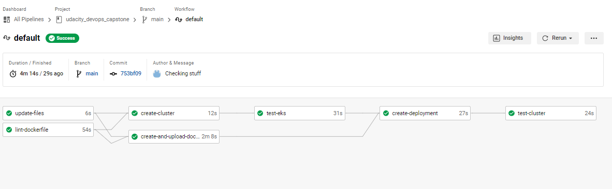

Final Cloud DevOps Engineer Capstone Project

> In this project, I applied my skills and knowledge which was developed throughout the Cloud DevOps Nanodegree program.

## Project Tasks:

* Working in AWS
* Using Jenkins to implement Continuous Integration and Continuous Deployment
* Building pipelines
* Working with CloudFormation to deploy clusters
* Building Kubernetes clusters
* Building Docker containers in pipelines

## About Project: 

> I created a CI/CD pipeline for a basic website that deploys to a cluster in AWS EKS.

